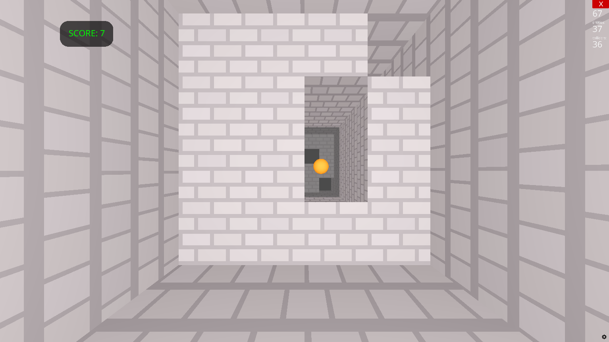

# Interstellar Dash



## Getting Started

1. Run the below commands to start the game.

```sh
pip install ursina
python main.py
```

2. Use `a`, `d`, and `space` keys to move left, move right, and jump respectively.
